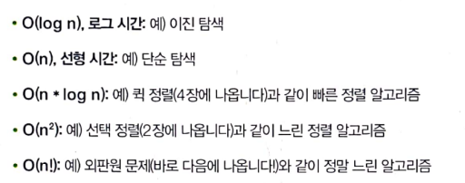
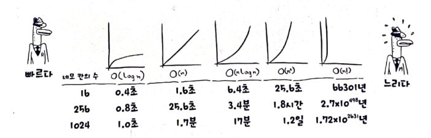

<details><summary>Gil</summary>
<p>

</p>
</details>


<details><summary>Yui</summary>
<p>

</p>
</details>


<details><summary>Eric</summary>
<p>

## 1. 알고리즘 소개
- binary search
  - O(log n)
  
    ```python
    def binary_search(list, item):
        low = 0
        high = len(list) - 1
        
        while low <= high:
            mid = (low + high) // 2
            guess = list[mid]
            if guess == item:
                return mid
            elif guess > item:
                high = mid - 1
            else:
                low = mid + 1
        return None
    ```
- 빅오 표기법은 최악의 경우
- 빅오 실행 시간
  
- 빅오 그래프
  

> ⚠️ 1장에서 배운 내용
> - 이진 탐색은 단순 탐색보다 아주 빠릅니다.
> - O(log n)은 O(n)보다 빠릅니다. 리스트의 원소의 개수가 증가하면 상대적으로 더 빨라집니다.
> - 알고리즘의 속도는 식나으로 측정하지 않습니다.
> - 알고리즘의 시간은 어떻게 증가하는가로 측정합니다.
> - 알고리즘의 시간은 빅오 표기법으로 나타냅니다.

## 2. 선택 정렬
- 배열 vs 연결 리스트   
  
  
- 선택정렬 (O(n^2))
  ```python
    def findSmallest(arr):
        smallest = arr[0]
        smallest_index = 0
        for i in range(1, len(arr)):
            if arr[i] < smallest:
                smallest = arr[i]
                smallest_index = i
        return smallest_index

    def selectionSort(arr):
        newArr = []
        for i in range(len(arr)):
            smallest = findSmallest(arr)
            newArr.append(arr.pop(smallest))
        return newArr

    print selectionSort([5, 3, 6, 2, 10])
  ```

## 3. 재귀
- 프로그램에 반복문을 사용하면 프로그램의 성능을 향상시킬수 있지만, 재귀를 사용하면 프로그래머의 능력을 향상 시킬수 있습니다. 상황에 따라 적절한 방법을 골라 사용하세요.

> ⚠️ 3장에서 배운 내용
> - 재귀는 함수가 스스로를 호출하는 것입니다.
> - 모든 재귀 함수는 기본 단계와 재귀 단계라는 두 부분으로 나누어져 있습니다.
> - stack에는 push와 pop이라는 두 가지 연산이 있습니다.
> - 모든 함수 호출은 호출 스택을 사용합니다.
> - 호출 스택은 너무 커져서 메모리를 엄청나게 소비할 수도 있습니다.

</p>
</details>

