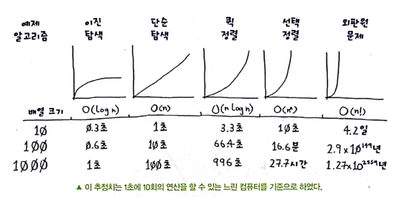

<details><summary>Gil</summary>
<p>

</p>
</details>


<details><summary>Yui</summary>
<p>

</p>
</details>


<details><summary>Eric</summary>
<p>

## 4. 퀵 정렬
- 분할 정복
- 퀵 정렬
  - 선택 정렬보다 훨씬 빠름
  ```python
    def quicksort(array):
        if len(array) < 2:
            return array
        else:
            pivot = array[0]
            less = [i for i in array[1:] if i <= pivot]
            greater = [i for i in array[1:] if i > pivot]
            return quicksort(less) + [pivot] + quicksort(greater)

    print quicksort([10, 5, 2, 3])
  ```
- 빅오 표기 비교
  
  

- 퀵 정렬
  
  

> ⚠️ 4장에서 배운 내용
> - 분할 정복은 문제를 더 작은 조각으로 나누어 풉니다. 만약 리스트에 분할 정복을 적용한다면 기본 단계는 원소가 없는 빈 배열이거나 하나의 원소만 가진 배열이 됩니다.
> - 퀵 정렬을 구현하려면 기준 원소를 무작위로 선택합니다. 퀵 정렬의 평균적인 실행 시간은 O(n long n)입니다.
> - 빅오 표기법에서 가끔씩 상수가 중요해질 때도 있습니다. 퀵 정렬이 병합 정렬보다 빠른 이유도 상수 때문입니다.
> - 단순 탐색과 이진 탐색을 비교할 때는 상수항이 전혀 문제가 되지 않습니다. 왜냐하면 리스트가 길어지면 O(log n)이 O(n)보다 훨씬 빨라지니까요.

## 5. 해시 테이블
- 해시 함수는 문자열을 받아서 숫자를 반환하는 함수
- 해시 테이블의 장점
  - 어떤 것과 다른 것 사이의 관계를 모형화 할 수 있습니다.
  - 중복을 막을 수 있습니다.
  - 서버에게 작업을 시키지 않고 자료를 캐싱할 수 있습니다.
- 빅오 표기
  ! [hash table bigO](images/hash%20table_bigO.png)

> ⚠️ 5장에서 배운 내용
> - 해시 테이블은 해시 함수와 배열을 결합해서 만듭니다.
> - 충돌은 나쁩니다. 충돌을 줄이는 해시 함수가 있어야 합니다.
> - 해시 테이블은 정말 빠른 탐색, 삽입, 삭제 속도를 가집니다.
> - 해시 테이블은 어떤 항목과 다른 항목의 관계를 모형화 하는데 좋습니다.
> - 사용률이 0.7보다 커지면 해시 테이블을 리사이징 할 때입니다.
> - 해시 테이블은 (웹 서버 등에서) 데이터를 캐싱하는 데도 사용됩니다.
> - 해시 테이블은 중복을 잡아내는 데도 뛰어납니다.

## 6. 너비 우선 탐색
- 최단 경로 문제를 푸는 알고리즘
- 너비 우선 탐색 코드
  ```python
    def search(name):
        search_queue = deque()
        search_queue += graph[name]
        searched = []
        while search_queue:
            person = search_queue.popleft()
            if not person in searched:
                if person_is_seller(person):
                    print person + " is a mango seller!"
                    return True
                else:
                    search_queue += graph[person]
                    searched.append(person)
        return False

    search("you")
  ```

  > ⚠️ 5장에서 배운 내용
  > - 너비 우선 탐색은 A에서 B로 가는 경로가 있는지 알려줍니다.
  > - 만약 경로가 존재한다면 최단 경로도 찾아줍니다.
  > - 만약 x까지의 최단 경로를 찾는 문제가 있다면 그 문제를 그래프로 모형화 해 보세요. 그리고 너비 우선 탐색으로 문제를 풉니다.
  > - 방향 그래프는 화살표를 가지며, 화살표 방향으로 관계를 가집니다.
  > - 무방향 그래프는 화살표가 없고, 둘 간의 상호 관계를 나타냅니다.
  > - 큐는 선입선출 입니다.
  > - 스택은 후입선출 입니다.
  > - 탐색 목록에 추가된 순서대로 사람을 확인해야 합니다. 그래서 탐색 목록은 큐가 되어야 합니다. 그렇지 않으면 최단 경로는 구할수 없습니다.
  > - 누군가를 확인한 다음에는 두 번 다시 확인하지 않도록 해야 합니다. 그렇지 않으면 무한 박복이 되어 버릴수 있습니다.

</p>
</details>